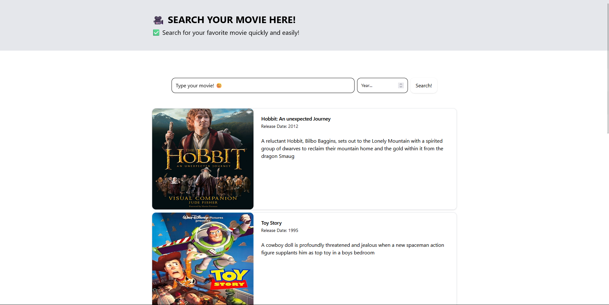
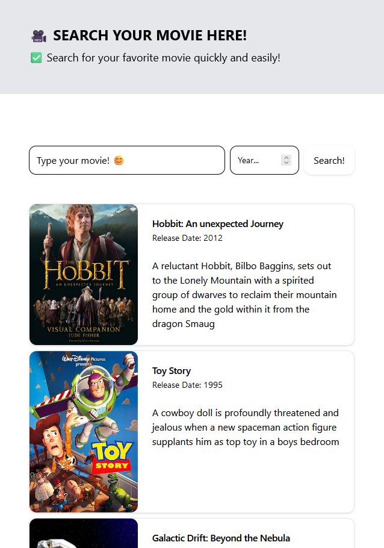

# Front end

Demonstração da aplicação com sua responsividade!

|  |  |  |
|--------------------------------|--------------------------------|--------------------------------|

## Tecnologias 

- React/Vite
- Vitest
- Axios
- SHADCN
- React Dom
- React Test Library

# Setup da aplicação

- `npm install`: Para instalar todas as depêndencias
- `npm run dev`: Para iniciar a aplicação

- `npm run test`: Para rodar os testes!

# Estrutura da aplicação

- Todos os componentes estão reunidos dentro da Diretório `components` 
com seus respectivos testes
- A Diretório `services` contem lógicas especificas que podem ser reutilizadas
em outros componentes, como chamdas de API.
- Diretório `Types` contém as interfaces gerais e tipos personalizados que podem
ser utilizados em varios componentes.
- Diretório `Assets` designada por armazenar imagens, icones e fontes
- Diretório `Test` responsave por armazenar arquivos de configuração de testes